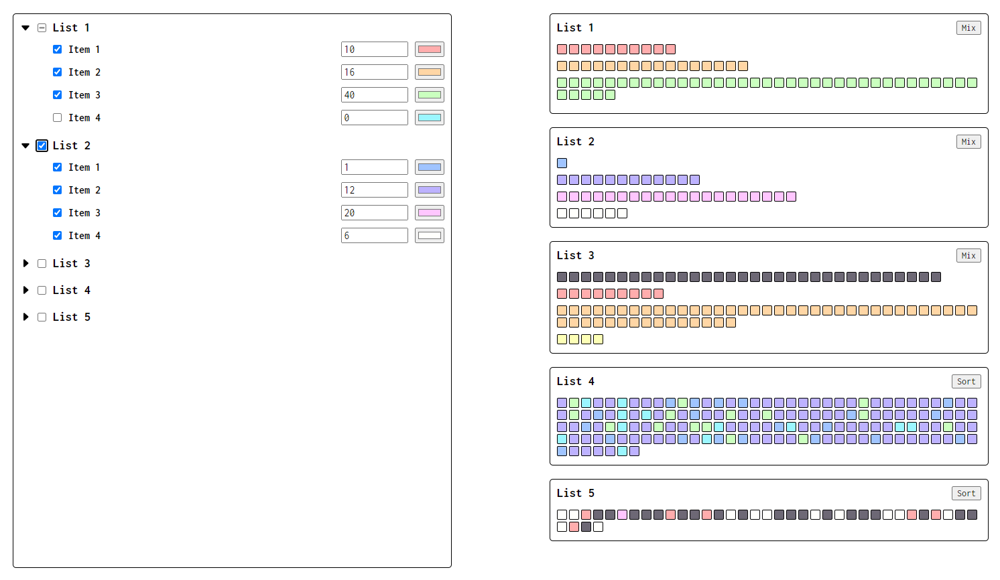
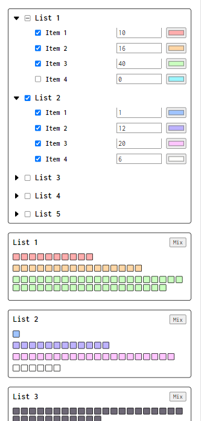

# lists-vue

### Desktop

### Mobile

**Примечание**: для хранения входных данных (сущности List) и выбранных элементов каждого из списков используется Vuex хранилище с двумя модулями: lists и select соответственно.
